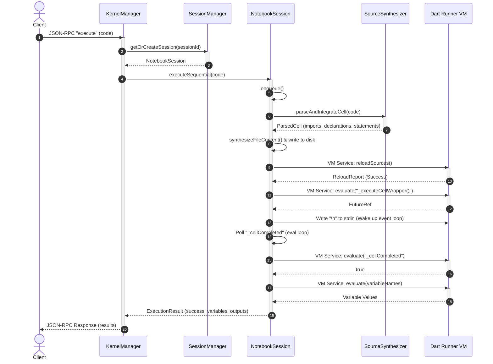

# Sequence Diagrams - DartLab Kernel

This document provides visual flow sequences for major kernel operations.

---

## 1. Cell Execution Sequence

This diagram details the sequence when a client sends an `execute` request over the JSON-RPC interface.



---

## 2. Stateful Subprocess Interrupt Sequence

This diagram shows how a runaway execution (e.g. `while(true) {}`) is cancelled while maintaining declarations.

```mermaid
sequenceDiagram
    autonumber
    actor Client
    participant KM as KernelManager
    participant NS as NotebookSession
    participant VM as Runaway Dart VM
    participant NewVM as Fresh Dart VM

    Note over KM,VM: Cell execution is running an infinite loop: while(true) {}
    Client->>KM: JSON-RPC "interrupt"
    activate KM
    KM->>NS: restart()
    activate NS
    NS->>NS: shutdown()
    NS->>VM: Kill process
    destroy VM
    NS->>NS: start()
    NS->>NS: synthesizeFileContent([]) (Contains cumulative declarations)
    NS->>NewVM: Spawn process (dart --enable-vm-service=0)
    activate NewVM
    NewVM-->>NS: Port / WS URL
    NS->>NS: Connect VM Service
    deactivate NS
    KM-->>Client: JSON-RPC Response (Session interrupted)
    deactivate KM
    Note over Client,NewVM: Subsequent execute requests run against NewVM with all prior classes and variables declared.
```
